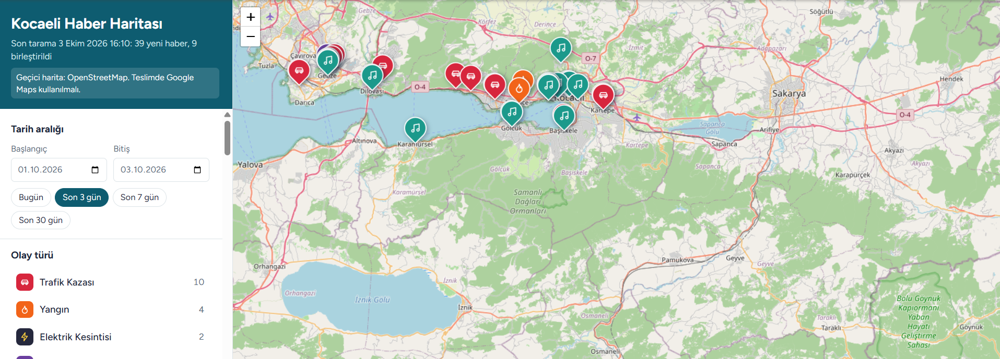

# Kocaeli Haber Haritası

Web kazıma tabanlı kentsel haber izleme ve harita üzerinde görselleştirme sistemi.
Kocaeli Üniversitesi Bilgisayar Mühendisliği, Yazılım Laboratuvarı-II, Proje I.



Sistem, Kocaeli'deki 5 yerel haber sitesinden son 3 günün haberlerini otomatik olarak toplar ve şu adımlardan geçirir:

- **Temizleme:** HTML, reklam ve gereksiz karakterlerden arındırma, Türkçeye uygun normalizasyon
- **Sınıflandırma:** Trafik Kazası, Yangın, Elektrik Kesintisi, Hırsızlık, Kültürel Etkinlikler (ağırlıklı anahtar kelime yöntemi)
- **Konum çıkarımı:** Metindeki cadde, sokak, mahalle, belirli yer ve ilçe ifadelerinin bulunması; en spesifik konumdan genele geocoding
- **Tekrar tespiti:** Farklı sitelerdeki aynı haberin çok dilli cümle gömme modeliyle (%90 benzerlik) bulunup tek kayıtta birleştirilmesi
- **Harita:** Türüne göre renkli ve sembollü işaretler; tür, ilçe ve tarih filtreleri

**Teknolojiler:** Python, MongoDB, Flask, BeautifulSoup, sentence-transformers, APScheduler, Google Maps / Leaflet + OpenStreetMap

📄 **Proje raporu (IEEE formatı):** [rapor/rapor.pdf](rapor/rapor.pdf) · LaTeX kaynakları `rapor/` klasöründe

---

## 0. Harita ve geocoding servisleri

Sistem iki farklı servis çiftiyle çalışabilir. Seçim `.env` dosyasından yapılır:

| Ayar | `google` | Ücretsiz seçenek |
|---|---|---|
| `GEOCODER` | Google Geocoding API | `nominatim` (OpenStreetMap Nominatim) |
| `MAP_PROVIDER` | Google Maps JavaScript API | `osm` (Leaflet + OpenStreetMap) |

Varsayılan değer `auto`'dur: Google anahtarı tanımlıysa Google, değilse ücretsiz servis kullanılır. Yani Google anahtarı olmadan da proje baştan sona çalışır. Anahtarları `.env` dosyasına eklediğiniz anda sistem kendiliğinden Google'a geçer. Bu geçiş için kodda hiçbir değişiklik gerekmez.

> ⚠️ **Teslim için önemli:** Proje dokümanı geocoding için "Google Geocoding API **gibi** bir servis" der, bu yüzden Nominatim isterlere uygundur. Ancak harita için açıkça **Google Maps** istenir. OpenStreetMap haritası yalnızca geliştirme ve test içindir. Teslimde `MAP_PROVIDER=google` kullanın ya da hocalardan yazılı onay alın. Ücretsiz modda arayüzün üstünde bunu hatırlatan bir not görünür.

**Nominatim kuralları:** Nominatim ücretsiz bir topluluk servisidir. Kullanım kuralları gereği saniyede en fazla 1 istek yapılır (kod bunu kendisi uygular). Sonuçlar önbelleğe alınır, böylece aynı adres tekrar sorulmaz. İsteklerde uygulama kendini tanıtır. `.env` dosyasına `NOMINATIM_EMAIL=` satırıyla kendi e-posta adresinizi yazmanız önerilir.

**Kart sorunu:** Google Cloud, Troy ve ön ödemeli kartları kabul etmez. Uluslararası geçerli bir Mastercard/Visa kart bulunana kadar ücretsiz servislerle çalışabilirsiniz.

---

## 1. Kurulum (Windows)

### 1.1 Python
Python 3.10 veya üstü gerekir. Kurulumda **"Add Python to PATH"** kutusunu işaretleyin.

### 1.2 MongoDB
1. [MongoDB Community Server](https://www.mongodb.com/try/download/community) indirin ve kurun. Kurulumda "Install MongoDB as a Service" seçili kalsın; böylece bilgisayar açılınca kendiliğinden çalışır.
2. Kurulum sihirbazı **MongoDB Compass** (görsel arayüz) kurmayı da önerir. Kurun; sunumda veritabanını göstermek için kullanacaksınız.
3. Compass'ı açıp `mongodb://localhost:27017` adresine bağlanabiliyorsanız MongoDB hazırdır.

### 1.3 Google Cloud anahtarları
Bu adım, Google servislerini kullanacaksanız gereklidir. Ücretsiz servislerle çalışıyorsanız şimdilik atlayabilirsiniz (bkz. Bölüm 0).

1. [Google Cloud Console](https://console.cloud.google.com/) üzerinden yeni bir proje oluşturun. Bu API'ler için faturalandırma hesabı bağlamak zorunludur; öğrenci kullanımı ücretsiz kullanım sınırının içinde kalır.
2. **APIs & Services → Library** bölümünden iki API'yi etkinleştirin:
   - **Geocoding API**
   - **Maps JavaScript API**
3. **APIs & Services → Credentials** bölümünden **iki ayrı** API anahtarı oluşturun:

| Anahtar | Nerede kullanılır | Kısıtlama |
|---|---|---|
| Geocoding anahtarı | Yalnızca Python sunucusunda | API restrictions: sadece *Geocoding API* |
| Maps JS anahtarı | Tarayıcıda (görünmek zorunda) | Application restrictions: *HTTP referrers* → `http://127.0.0.1:5000/*` ve `http://localhost:5000/*`; API restrictions: sadece *Maps JavaScript API* |

> **Neden iki anahtar?** Haritayı çizen anahtar tarayıcıya gönderilmek zorundadır; sayfa kaynağını açan herkes onu görebilir. Bu yüzden yalnızca kendi adresinizden çalışacak şekilde kısıtlanır. Geocoding anahtarı ise hiçbir zaman tarayıcıya gitmez, `.env` dosyasında durur. "API anahtarı güvenli biçimde saklanmalıdır" isteri bu şekilde karşılanır.

### 1.4 Projeyi hazırlama
Proje klasöründe komut istemcisini (cmd) açın:

```bat
python -m venv .venv
.venv\Scripts\activate
pip install -r requirements.txt
copy .env.example .env
```

`.env` dosyasını bir metin editörüyle açın. Google kullanacaksanız iki anahtarı yazın; ücretsiz servislerle çalışacaksanız bu satırları boş bırakın:

```
GOOGLE_GEOCODING_API_KEY=AIza...sunucu_anahtari
GOOGLE_MAPS_JS_API_KEY=AIza...tarayici_anahtari
```

> `pip install` adımı `sentence-transformers` ile birlikte PyTorch da indirir, birkaç dakika sürebilir. Embedding modeli (~470 MB) **ilk taramada** bir kez internetten indirilir, sonra bilgisayarda saklanır.

---

## 2. Çalıştırma

```bat
.venv\Scripts\activate
python app.py
```

Tarayıcıda **http://127.0.0.1:5000** adresini açın.

- Uygulama açıldıktan 5 saniye sonra ilk tarama otomatik başlar. Sonrasında tarama varsayılan olarak her 60 dakikada bir tekrarlanır (`.env` → `SCRAPE_INTERVAL_MINUTES`).
- Arayüzdeki **"Haberleri tara"** butonu taramayı istediğiniz gün sayısıyla elle başlatır.
- İlk tarama modeli indirdiği için daha uzun sürer. İlerlemeyi panelin altındaki durum satırından izleyebilirsiniz.

Taramayı arayüz olmadan, komut satırından da çalıştırabilirsiniz:

```bat
python pipeline.py              :: son 3 gün
python pipeline.py --days 7     :: son 7 gün
python pipeline.py --reset      :: daha önce elenen linkleri de yeniden değerlendir
```

---

## 3. Proje yapısı

```
kocaeli-haber-haritasi/
├── app.py                  Flask: sayfa + REST API + otomatik zamanlayıcı
├── pipeline.py             Ana işlem hattı (tüm adımları sırayla çalıştırır)
├── config.py               Ayarlar (.env'den okunur)
├── db/mongo.py             MongoDB bağlantısı ve indeksler
├── scraper/
│   ├── base.py             Ortak scraper: link keşfi, sayfa ayrıştırma, son N gün
│   ├── http_client.py      İstek, tekrar deneme, bot korumasına karşı yedek
│   ├── dates.py            Tarih okuma (ISO, RSS, "22 Eylül 2026 16:18")
│   └── sites/              5 haber kaynağı
├── processing/
│   ├── cleaner.py          Veri temizleme ve ön işleme
│   ├── classifier.py       Haber türü sınıflandırma (anahtar kelimeler burada)
│   ├── location.py         Konum çıkarımı
│   ├── geocoder.py         Google Geocoding + önbellek + doğrulama
│   └── dedup.py            Embedding tabanlı benzer haber tespiti
├── utils/                  Türkçe metin ve saat dilimi yardımcıları
├── templates/index.html    Arayüz
├── static/                 CSS ve JavaScript (harita, filtreler)
├── tools/
│   ├── keywords_latex.py   Anahtar kelime tablosunu LaTeX olarak üretir
│   ├── reclassify.py       Kayıtlı haberleri güncel kurallarla yeniden sınıflandırır
│   └── show_locations.py   Sunum için tespit edilen konumları gösterir
├── tests/                  62 otomatik test
├── rapor/                  IEEE formatında LaTeX raporu ve PDF'i
└── .env.example            Ayar dosyası örneği (.env olarak kopyalanır)
```

---

## 4. İsterlerin karşılanması

### 4.1 Teknoloji ve veritabanı
Proje Python ile yazıldı. Veritabanı olarak MongoDB kullanılır ve şu koleksiyonlardan oluşur:

| Koleksiyon | İçerik |
|---|---|
| `news` | Haritada gösterilen haberler |
| `processed_urls` | İncelenen her linkin sonucu ve elenme nedeni |
| `geocache` | Geocoding önbelleği |
| `scrape_runs` | Her taramanın özeti |

### 4.2 Haber türleri
Beş tür tanımlıdır: Trafik Kazası, Yangın, Elektrik Kesintisi, Hırsızlık ve Kültürel Etkinlikler. Her habere tek bir tür atanır ve bu tür `news.type` alanında ayrı olarak saklanır.

### 4.3 Web scraping
- **Kaynaklar:** Dokümanda verilen 5 yerel site kullanılır, ulusal haber sitesi kullanılmaz.
- **Son 3 gün kuralı:** Linkler yeniden eskiye taranır. RSS tarihine göre eski olanlar hiç indirilmez. Arka arkaya 12 eski habere rastlanınca o sitenin taraması durur.
- **Otomatik ve tekrar tetiklenebilir:** APScheduler zamanlayıcısı taramayı belirli aralıklarla çalıştırır. Ayrıca "Haberleri tara" butonu ve `POST /api/scrape` ucu taramayı elle başlatır. Aynı anda iki tarama çalışamaz.
- **Kaydedilen alanlar:** tür, başlık, içerik, konum metni ve enlem/boylam, yayın tarihi, site adı, link.
- **Tekrar kontrolü:**
  - Aynı link ikinci kez işlenmez. Bu hem `processed_urls` ile hem de `sources.url` üzerindeki unique indeksle garanti altındadır.
  - Farklı sitelerdeki aynı haber, embedding benzerliğiyle tespit edilir. Benzerlik %90 ve üzeriyse yeni kayıt açılmaz, haber tek kayıtta birleştirilir ve tüm kaynaklar `sources` listesine eklenir.
- **Kaynakların gösterimi:** Bilgi penceresi, haberin yer aldığı tüm siteleri listeler.

### 4.4 Ön işleme
Aşağıdaki adımların her biri `processing/cleaner.py` içinde ayrı bir fonksiyondur:
- HTML etiketlerinin temizlenmesi
- Reklam ve alakasız blokların çıkarılması: `class`/`id` değerinde reklam, ilgili haber, paylaş, yorum gibi ifadeler geçen bloklar
- Özel karakterlerin ve emojilerin silinmesi
- Fazla boşlukların temizlenmesi
- Unicode ve Türkçe harf normalizasyonu
- Görsel altlarında tekrarlanan başlıkların ve "ABONE OL" gibi kalıp satırların silinmesi

### 4.5 Sınıflandırma
Sınıflandırma otomatiktir ve ağırlıklı anahtar kelime puanlamasına dayanır. Negatif kelimeler yanlış eşleşmeleri bastırır. Bir haber birden fazla türe uyuyorsa öncelik sırasına göre seçim yapılır:

**Yangın > Trafik Kazası > Hırsızlık > Elektrik Kesintisi > Kültürel Etkinlikler**

Sonuç, puanlar ve eşleşen kelimelerle birlikte `news.classification` alanına kaydedilir. Raporda istenen kelime listesi için bkz. Bölüm 6.

### 4.6 Konum çıkarımı
Konum çıkarım yöntemi `processing/location.py` dosyasının başında ayrıntılı olarak açıklanmıştır. Rapordaki "konum çıkarım yöntemi" bölümünü buna göre yazabilirsiniz.
- Metindeki tüm konum ifadeleri bulunur ve `news.location.candidates` alanında saklanır.
- Geocoding sorguları en spesifikten genele doğru denenir: önce sokak, sonra yer, mahalle, yol ve en son ilçe.
- Konum bulunamazsa haber haritaya eklenmez.

### 4.7 Geocoding
- Google Geocoding API veya OpenStreetMap Nominatim kullanılır (Bölüm 0). Google anahtarı `.env` dosyasında saklanır.
- İki servis aynı ortak sınıftan türer. Önbellek, Kocaeli doğrulaması ve "en spesifikten genele" deneme mantığı ortaktır.
- Koordinatlar `lat`, `lng` ve `geo` alanlarına kaydedilir.
- Geocoding başarısız olursa kayıt işlenmez.
- Aynı adres için tekrar API çağrısı yapılmaz; sonuç önce bellekte, sonra MongoDB `geocache` koleksiyonunda aranır. Önbellek kaydı servis adıyla birlikte tutulur, bu yüzden iki servisin sonuçları karışmaz.

### 4.8 Harita ve arayüz
- **Harita sağlayıcısı:** Harita kodu küçük bir "adaptör" arayüzüyle yazılmıştır: işaret ekle, işaret kaldır, bilgi penceresi aç. Bu arayüzün biri Google Maps, biri Leaflet için olmak üzere iki uygulaması vardır. Filtreler, liste ve bilgi penceresi iki haritada da aynı kodla çalışır.
- **Harita:** Kocaeli merkezinde (İzmit) açılır. Her haber için bir işaret eklenir; işaretin rengi ve sembolü haber türüne göre değişir.
- **Bilgi penceresi:** Başlık, tarih, kaynak adları ve "Habere git" butonunu içerir. Buton haberi yeni sekmede açar.
- **Filtreler:** Tür, ilçe ve tarih filtreleri sayfa yenilenmeden uygulanır. Haberler `fetch` ile alınır.

---

## 5. Sunum için

### Tespit edilen konumları gösterme
```bat
python -m tools.show_locations --limit 10
```
Her haber için şunlar listelenir: metinde bulunan tüm konum adayları, seçilen konum, Google'ın döndürdüğü adres ve denenen sorgular (✓/✗ ve nedenleri).

```bat
python -m tools.show_locations --skipped
```
Elenen haberleri ve elenme nedenlerini gösterir (Kocaeli dışı, türü yok, konum yok...).

### MongoDB Compass'ta
`kocaeli_haber` → `news` koleksiyonunu açın. Filtre kutusuna örneğin şunları yazabilirsiniz:

```js
{ "type": "Yangın" }                         // türe göre
{ "district": "Gebze" }                      // ilçeye göre
{ "sources.1": { $exists: true } }           // birden fazla kaynakta yer alan haberler
```

Bir belgeyi açtığınızda `location.candidates`, `location.attempts` ve `classification` alanları, konum ve türün nasıl bulunduğunu gösterir.

### Haberin türü neden böyle belirlendi?
```bat
python -m tools.reclassify --all
```
Her haber için tür puanlarını ve eşleşen anahtar kelimeleri gösterir. Anahtar kelimeleri değiştirdikten sonra mevcut kayıtları siteleri yeniden taramadan güncellemek için:
```bat
python -m tools.reclassify            :: önizleme, hiçbir şey değişmez
python -m tools.reclassify --apply    :: değişiklikleri kaydet
```
Artık hiçbir türe girmeyen haberler haritadan kaldırılır.

### Arayüzde
Bilgi penceresindeki **"Tespit edilen konumlar"** bölümü de aynı bilgiyi gösterir.

---

## 6. Rapor (LaTeX) için anahtar kelime tablosu

Raporda anahtar kelimelerin listelenmesi zorunludur. Tabloyu koddan otomatik üretin:

```bat
python -m tools.keywords_latex > anahtar_kelimeler.tex
```

LaTeX dosyanızın başına `\usepackage{booktabs}` ekleyin (tablo IEEE'nin iki sütunlu düzenine uygun, sayfa genişliğinde üretilir), tabloyu `\input{anahtar_kelimeler.tex}` ile çağırın. Anahtar kelimeleri değiştirirseniz bu komutu tekrar çalıştırmanız yeterlidir.

---

## 7. Testler

```bat
pip install -r requirements-dev.txt
python -m pytest -q
```

62 test şu alanları kapsar:
- **Temizleme:** reklam, tekrar ve emoji temizliği
- **Sınıflandırma:** her tür, negatif kelimeler, güçlü kelime şartı, gerçek taramadan çıkan yanlış örnekler ve öncelik sırası
- **Konum çıkarımı:** gerçek haber metinleriyle, Bursa/Yalova/Tuzla gibi Kocaeli dışı haberlerin elenmesi dahil
- **Scraper:** link filtreleme ve sayfa ayrıştırma
- **Geocoding:** Google ve Nominatim cevaplarının işlenmesi, servis seçimi, önbellek ve hız sınırı
- **Pipeline:** kayıt, birleştirme, elenme nedenleri ve geocoding önbelleği
- **API:** filtreler

Testler gerçek MongoDB, Google veya Nominatim gerektirmez; sahte (mock) veritabanı ve servislerle çalışır.

---

## 8. Sorun giderme

| Belirti | Çözüm |
|---|---|
| `MongoDB'ye bağlanılamadı` | Windows Hizmetler'de "MongoDB Server" çalışıyor mu? Compass ile bağlanabiliyor musunuz? |
| Harita gri, "anahtar reddedildi" uyarısı | Maps JS anahtarında *Maps JavaScript API* etkin mi? Referrer kısıtlaması `http://127.0.0.1:5000/*` içeriyor mu? |
| Tarama bitiyor ama hiç haber kaydedilmiyor | `python -m tools.show_locations --skipped` çalıştırın. `geocode_error` görüyorsanız Geocoding anahtarı veya faturalandırma sorunludur. Bu haberler anahtar düzelince otomatik yeniden denenir. |
| Bir siteden hiç link gelmiyor | `processed_urls` boşsa site istekleri engelliyor olabilir. `curl_cffi` kurulu mu kontrol edin (`requirements.txt` içinde). Site tasarımı değiştiyse `scraper/sites/` içindeki liste sayfası yollarını ve `content_selectors` değerini tarayıcıda F12 ile inceleyip güncelleyin. |
| İlk tarama çok uzun sürüyor | Embedding modeli indiriliyordur, bu yalnızca bir kez olur. Nominatim kullanıyorsanız saniyede 1 istek sınırı nedeniyle ilk taramada geocoding de yavaştır; sonraki taramalar önbellekten hızlı ilerler. |
| `geocode_error` ve "Nominatim isteği reddetti (HTTP 403/429)" | Çok sık istek yapılmış veya uygulama tanıtılmamış olabilir. `.env` dosyasına `NOMINATIM_EMAIL` ekleyin, bir süre bekleyip tekrar deneyin. Bu haberler sonraki taramada otomatik yeniden denenir. |
| Harita kartları (OSM) yüklenmiyor | İnternet bağlantısını kontrol edin. Leaflet ve harita karoları internetten yüklenir. |
